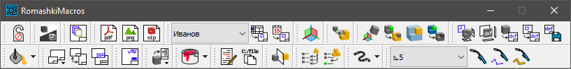

Romashki Macros
===============

**Romashki Macros** &mdash; это коллекция скриптов для автоматизации работы в Компас-3D.

Целью этого проекта на GitHub является размещение открытого исходного кода этих скриптов.

В этом проекте немалая доля функционала узкоспециализирована. В ряде случаев подразумевается работа по определенной методологии. Не&nbsp;исключено, что для массового пользователя некоторые макросы могут быть неприменимы или неудобны.

Большинство макросов поддерживают Компас&nbsp;v16. Все макросы работоспособны в&nbsp;Компас&nbsp;v22.

Краткое описание
----------------

Графический интерфейс программы представляет собой окно, по-умолчанию отображаемое поверх всех окон, с настраиваемой панелью команд.

Коллекция включает в себя следующие макросы:
* `do_not_disturb` &mdash; переключение режима "Не&nbsp;беспокоить" (отключение всплывающих окон типа "Перестроить сборку?" с ответом "Нет" на них);
* `change_bg` &mdash; переключение цвета фона модели и чертежа (например, для скриншотов);
* `dwg_hidden_layers` &mdash; создание скрытых слоёв в видах чертежа;
* `fast_export` &mdash; экспорт по одному клику в разные форматы, включая PDF;
* `stamp` &mdash; заполнение основной надписи по настраиваемым шаблонам;
* `fix_lcs` &mdash; исправление настроек создания локальных систем координат в модели;
* `fast_mate` &mdash; создание особым образом сопряжений "Совпадение" в сборках;
* `fast_parts` &mdash; создание деталей при работе по методологии сверху-вниз;
* `fast_dxf` &mdash; экспорт DXF-фрагмента из модели или чертежа;
* `fast_material` &mdash; задание материала и плотности в обход Справочника "Материалы и сортаменты" из своего настраиваемого списка;
* `sheet_layout` &mdash; применение оформления чертежа из lyt-библиотеки;
* `surface_and_demand` &mdash; указание общей шероховатости и технических требований на чертеже (для старых версий Компаса, где не&nbsp;было шаблонов);
* `exclude_from_spc` &mdash; управление включением в спецификацию деталей в сборке (для старых версий Компаса);
* `parts_painting` &mdash; покраска компонентов сборки, в том числе иерархическая;
* `bulk_rename` &mdash; пакетное изменение некоторых свойств компонентов сборки в их моделях-источниках;
* `fast_mirror` &mdash; создание зеркального массива для тел при выборе их элементов (вершин, ребер, граней);
* `fast_rollback` &mdash; изменение порядка элементов дерева построения;
* `fast_rvd` &mdash; некоторая автоматизация при работе с моделями рукавов высокого давления;
* `welding` &mdash; создание упрощенных твердотельных обозначений сварных швов;

а также модуль `HEAD.py` с удобными функциями для упрощения разработки макросов Компас-3D, с поддержкой Python type hints (указаний о типах); и другие модули для разработки графических интерфейсов на PyQt5.

Подробное описание каждой команды каждого макроса в этом проекте отсутствует, но в каждом модуле Python-кода есть пояснения его принципов работы.

Скачать
-------
Программа поставляется в виде одного исполняемого файла. Устанавливать ничего не&nbsp;требуется.

Последнюю скомпилированную версию можно скачать в разделе [Релизы](https://github.com/nikitamamay/romashki-macros/releases).

Работа с исходным кодом
-----------------------

Для работы с исходниками нужно подготовить файлы библиотек Компас&nbsp;API согласно [видео-инструкции](https://youtu.be/UVCH_wDlFNU?t=863) от Сергея Кузьмина, а именно:

1. Установить пакет `pywin32`:

        pip install pywin32

2. Скопировать файлы:

        Kompas6API5.py
        KompasAPI7.py
        ksConstants.py
        ksConstants3D.py
        LDefin2D.py
        LDefin3D.py
        MiscellaneousHelpers.py

    из папки (путь может отличаться):

        C:\ProgramData\ASCON\KOMPAS-3D\21\Python 3\App\Lib\site-packages\pythonwin

    в папку (путь может отличаться):

        C:\Program Files\Python39\Lib\site-packages\pythonwin

3. Также может потребоваться установка пакетов `PyQt5`, `pyexcel_ods3` и других.

Смотрите также
--------------
Обратите внимание на мой проект [Romashki Dimensions](https://github.com/nikitamamay/romashki-dimensions) &mdash; программу-макрос для работы с размерами в чертежах Компас-3D.

Загляните на [мой сайт](https://nikitamamay.github.io/) &mdash; там есть генератор тернарных выражений для переменных в Компас-3D, калькулятор допусков и посадок и еще некоторые полезности.
